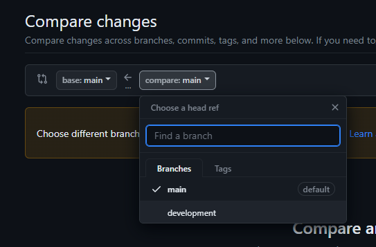

# Casabella construtora

## Como subir uma nova versão pra teste em desenvolvimento

Pra fazer alterações e subir uma nova versão primeiramente deve se mover para a
branch correta, `development`, para fazer isso

1. Clica no botão `main` como mostrado no print abaixo
   
2. Seleciona a branch `development`
   

Em seguida é necessário acessar o editor de arquivos online do github, pra isso basta clicar no botão `Go to file` como mostrado na imagem abaixo


Ao fazer isso vc verá uma tela como abaixo, pra alterar o arquivo basta procurar na arvore de arquivos (semelhante ao explorar do windows)


Pra saber qual arquivo é de qual sessão, basta seguir a relação abaixo

```
Primeira dobra -> Home
Segunda dobra -> Tour
Terceira dobra -> Portfolio
Quarta dobra -> Contact
Quinta dobra -> About
```

### Exemplo de mudança ou adição de imagem ao carrosel na home

Pra modificar alguma imagem da home, basta seguir os passos abaixo

1. Adiciona o arquivo na pasta que desejar dentro de `src/assets/` como os print
   a seguir
   
   
   
1. Procura a sessão de imports da home como mostrado no print abaixo
   
1. Procura o arquivo da home nas pastas, fica em `src/components/molecules/Home.vue`
   
1. Com o arquivo `Home.vue` selecionado clicar em editar como no print
   
1. Adiciona uma nova linha (ou caso queria alterar algum é só trocar) por uma
   linha equivalente como mostrado no print abaixo
   
1. Adiciona um novo bloco como o mostrado a seguir no objeto de slides do print
   abaixo
   

```
{
  alt: `Exemplo de texto alternativo pra quando a imagem não for carregada`,
  source: exemplo
}
```

1. Clicar em `Commit changes`
   
1. Clicar em `Commit changes` pra confirmar as mudanças
   

Seguindo todos esses passos basta aguardar 1min pro deploy ser realizado e
acessar [essa url](https://casabella-contrutora-git-development-will-lucena.vercel.app/) pra ver as mudanças antes de subirmos pra produção na url real.

Se estiver tudo ok, basta seguir os próximos passos pra atualizarmos a [versão em
produção](https://casabellaconstrucao.com.br/)

### Exemplo de mudança ou adição nos itens do portifólio

Seguindo passos semelhantes ao do exemplo da home podemos editar o arquivo
`Portfolio.vue` localizado em `src/components/molecules/Portfolio.vue`.
Para atualizar a imagens precisamos fazer o mesmo processo exemplificado anteriormente de adicionar o arquivo nos assets e importar na sessão de imports do arquivo `Portfolio.vue`, porém onde iremos adicionar um novo bloco de código é um pouco diferente:

#### Alterando um empreendimento no portfolio

- Pra alterar o texto basta identificar o item que deseja alterar e modificar o
  texto da variável `copy` como mostrado no print abaixo


- Para alterar alguma imagem ou adicionar, uma vez feito os passos de importa-la, basta adicionar ou alterar o bloco semelhante abaixo

```
{
  alt: `Exemplo de texto alternativo pra quando a imagem não for carregada`,
  source: exemplo
}
```

#### Removendo um empreendimento do portfolio

- Para remover um empreendimento do portfolio basta deletar todo o bloco dentro de `{}` que contém `slides` e `copy` como exemplificado no print a seguir


#### Adicionando um empreendimento ao portfolio

- Para adicionar um empreendimento basta adicionar um novo bloco de código como o exemplo abaixo após um dos blocos, porém isso irá causar alterações no layout podendendo comprometer a experiência uma vez que o layout foi projetado para 3 itens apenas

```
{
  slides: [
    {
      alt: `Exemplo de texto alternativo pra quando a imagem não for carregada`,
      source: exemplo1
    },
    {
      alt: `Exemplo de texto alternativo pra quando a imagem não for carregada`,
      source: exemplo2
    }
  ],
  copy: `Exemplo de copy do novo empreendimento`
}
```


## Como subir uma nova versão em produção

1. Com nossas mudanças já validadas em desenvolvimento podemos seguir com o deploy
   de produção, para o tal iremos acessar o menu `Pull requests` como mostrado
   na imagem abaixo
   

1. Clicar em `New pull request`
   

1. Confirmar que a branch `base` é a main e alterar a `compare` para `development`
   

1. Criar o pull request clicando em `Create pull request`
   

1. Confirmar a criação do PR
   

1. Em seguida juntamos as alterações e o deploy será feito ao clicar em
   `Merge pull request`
   

Similar ao nosso deploy em desenvolvimento para validação, após o merge das alterações basta aguardar um minuto e para que nossas alterações estejam acessíveis em [https://casabellaconstrucao.com.br/](https://casabellaconstrucao.com.br/)
